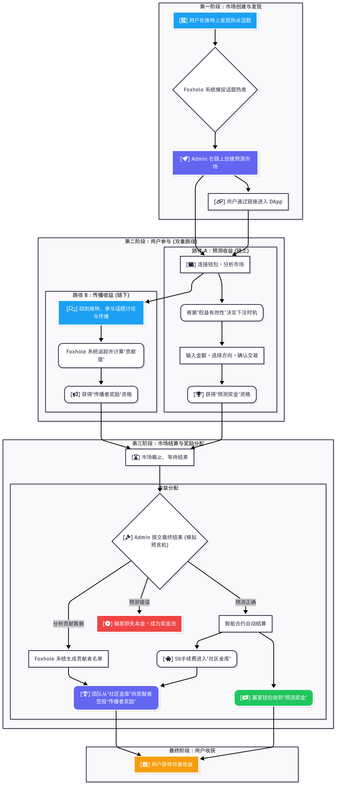

# InfoMeme: Where Attention Becomes an Asset

**标语: 预测热点，引爆Meme，将影响力直接变现。**

## 1. 项目愿景：构建新一代信息市场

InfoMeme 不仅仅是一个预测市场。我们正在构建一个将**社交热度**、**群体智慧**和**个人影响力**深度融合的去中心化平台。

在 InfoMeme，我们坚信**信息本身就是一种可交易的资产 (Information as an Asset)**。我们观察到，用户渴望交易他们能理解的宏大叙事——比如“AI 浪潮”或“稳定币心智份额”，而不是费力去挑选单个的、充满不确定性的代币。

为此，我们开创了一个全新的市场。我们强大的链下数据基建（Foxhole）能够捕捉任何一个引爆全网的热点、一个充满争议的话题，并将其抽象的**“叙事热度”或“心智份额”量化为一个实时变化的、可交易的指数**。这个指数本身，就是我们市场的“标的物”。

这与传统预测市场有着根本不同：我们交易的不再是拥有确定性结局的事件（如选举），而是那些持续演变的、没有终局的**“叙事”本身**。我们的指数就是唯一的“事实来源 (Source of Truth)”，它让“一个明星的未来热度”或“一个Meme的生命力”这类模糊概念，首次变得可量化、可交易。在这个市场中，信息是公开的，**每个人都是局内人，也因此，没有人是局内人**。这创造了一个更公平、更透明的博弈场。

我们的目标是：让每一个用户都能通过自己敏锐的判断力和独特的社交影响力，从信息的生命周期中捕获价值。

## 2. 核心创新：我们的“Alpha”

InfoMeme 通过两大核心创新，彻底颠覆了传统预测市场的玩法：

### a. 分时加权权益 (Time-Weighted Staking)

这是我们游戏机制的基石。我们认为，**更早的信念值得更高的回报**。

- **工作原理**: 用户的有效权益（即决定其奖金份额的权重）会根据其入场时间动态计算。公式为 `有效权益 = 投入金额 * √(剩余时间 / 总时间)`。
- **策略深度**: 这创造了一个全新的博弈维度。用户不再是简单地预测“对”或“错”，而是需要在“信息的确定性”和“时间的有效性”之间做出权衡。
- **机制优势**:
  - **奖励早期信念**: 极大地激励了那些在信息尚不明确时就敢于承担风险的早期参与者。
  - **防止最后狙击**: 从机制上杜绝了掌握内幕消息者在最后一秒入场“收割”的行为，保护了市场的公平性。

### b. 传播即挖矿 (Mindshare-to-Earn)

这是我们增长飞轮的引擎。我们认为，**影响力本身就是一种可量化的资产**。InfoMeme 创造了一个完整的经济闭环，让用户可以通过两种方式从“心智份额 (Mindshare)”中获利：

- **工作原理**:
  1. **交易心智份额**: 用户可以直接对我们系统量化的“话题热度指数”进行看涨 (Long) 或看跌 (Short) 的购买。这不仅是对未来热度的直接预测，其本身也是一种影响市场的行为。
  2. **贡献心智份额**: 用户可以在链下通过社交媒体（如推特）的讨论和分享，积极地影响和传播话题。我们强大的链下数据基建（Foxhole）会持续追踪这些行为，并识别出关键的传播者和贡献者。
  3. **价值捕获与分配**:
     - **手续费入库**: 每个市场结算时，总资金池的固定百分比（例如5%）将作为手续费，自动进入一个公开透明的“社区金库”。
     - **精准空投**: 市场结束后，我们会根据链下分析的“贡献值”数据，将社区金库中的奖励精准地空投给那些为话题传播做出贡献的用户。
- **价值闭环**: 这创造了一个完美的价值闭环。用户不仅可以通过**交易预测**获利，更能通过**传播贡献**获得额外收益，将每一次转发、评论和点赞，都转化为实实在在的资产。

## 3. 玩法流程：我的双重收益之旅

作为一名用户，您在 InfoMeme 的旅程将是激动人心的：

## 4. 技术架构与演进路线

InfoMeme 构建在高性能的 **Aptos** 区块链之上，利用 **Move** 语言的安全性为用户资产保驾护航。

### a. MVP 阶段 (当前)

为了快速验证核心玩法，我们的 MVP 版本采用了**P2P（点对点）资金池模型**并引入了**用户领取 (Claim)** 机制。

- **模型**: 赢家的奖金直接来源于输家的资金池。
- **结算**: 采用管理员提交结果（模拟预言机）+ 用户主动 `claim_winnings` 的模式，兼顾了安全性和去中心化特性。
- **目的**: 此阶段的核心是向世界证明，我们的“分时加权”和“传播者奖励”两大机制是可行且极具吸引力的。

### b. 愿景 (V2 及未来)

我们的最终目标是构建一个拥有深度流动性和专业级体验的**全功能 AMM 预测市场**。

- **演进方向**: 我们将引入基于 **LMSR (对数市场评分规则)** 的 AMM 算法，将 P2P 模型升级为流动性池模型。
- **为何升级**:
  - **无限流动性**: AMM 确保市场永远有对手盘，用户随时可以交易。
  - **价格发现**: 结果代币的价格将实时反映市场概率，提供更丰富的交易信息。
  - **资本效率**: 允许流动性提供者参与，并通过手续费和代币激励获利，从而创造更深的市场。
- **最终形态**: **AMM 交易引擎 + 分时加权博弈层 + 传播者奖励增长飞轮**，三者结合，将构成 InfoMeme 独一无二的强大护城河。

## 5. InfoMeme 增长飞轮

我们的三大核心系统共同构成了一个强大的、自我强化的增长飞轮：

1. **Foxhole 系统**捕捉全网热点，自动生成源源不断的优质市场内容。
2. **分时加权预测市场**以其独特的博弈性吸引用户参与和投入资金。
3. **传播者奖励**激励所有参与者在链下进行社交传播，进一步扩大话题热度。
4. 被放大的**话题热度**又会被 Foxhole 系统捕捉，从而创造出新的市场机会。

这是一个循环往复、不断加速的增长闭环。

**加入我们，一起定义信息的未来。**
